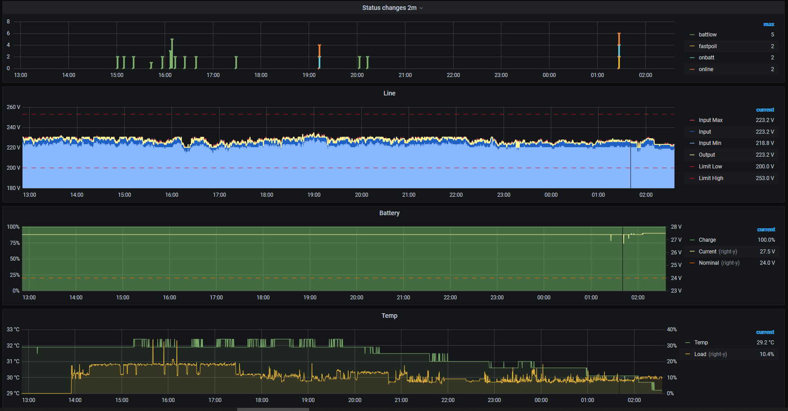

# Prometheus apcupsd exporter

[](https://hub.docker.com/repository/docker/iodeveloper/prom-apcupsd-exporter/)

[](https://registry.hub.docker.com/r/iodeveloper/prom-apcupsd-exporter)

`iodeveloper/prom-apcupsd-exporter:latest`

## Use cases

* Provides wide apcupsd metrics for prometheus.
  * `apcupsd_input_*`: input line metrics
  * `apcupsd_output_*`: output line metrics
  * `apcupsd_battery_*`: battery metrics
  * `apcupsd_ups_*`: UPS status and settings
  * `apcupsd_shutdown_*`: apcupsd shutdown settings

* Can be integrated with apccontrol signals such as `powerout`, `startselftest` and etc.

* Built-in websocket server allow to connect and notify web clients for events/signals.
Example: lightweight status widget on pure js/css (responsive alternative to grafana for realtime monitoring - see https://github.com/io-developer/vue-ups).

* This exporter calculates events between previous and latest states. Changed fields and new events are broadcasting to connected clients via websocket.

## Grafana example




#### Prerequisites

_Both services in docker because server shutdown is not required_

SUA1500i connected via serial port /dev/ttyS0 in smart mode. After start on host appear two ports: 3559 - apcupsd, 3560 - exporter.

#### docker-compose.yml

```yml
version: '3.4'

services:
  apcupsd:
    build: .
    restart: always
    user: root
    devices:
      - "/dev/ttyS0:/dev/ttyS0"
    volumes:
      - ./conf:/etc/apcupsd
      - ./log/apcupsd.events:/var/log/apcupsd.events
      - ./log/apcupsd.trace:/apcupsd.trace
    ports:
      - "0.0.0.0:3559:3551"

  exporter:
    image: iodeveloper/prom-apcupsd-exporter:latest
    restart: always
    ports:
      - "0.0.0.0:3560:8001"
    command: [
      "--logLevel", "warn",
      "--apcupsd", "apcupsd:3551",
      "--apcupsdStartSkip", "20",
      "--collectInterval", "10",
      "--defaultModelState", '{"OutputPowerNominal": 900, "OutputPowerApparentNominal": 1500}'
    ]
```

#### ./conf/apcupsd.conf

```ini
UPSCABLE smart 
UPSTYPE apcsmart
DEVICE /dev/ttyS0
POLLTIME 3

ONBATTERYDELAY 0
BATTERYLEVEL 0
MINUTES 0
TIMEOUT 0
KILLDELAY 0

NETSERVER on
NISPORT 3551

# other by default
```

#### ./conf/doshutdown

```sh
#!/bin/sh

touch /etc/apcupsd/shuttingdown
exit 99
```

#### ./conf/mainsback

```sh
#!/bin/sh

# Kill and reload apcupsd to reset `shutdown` status flags after mains back
if [ -f /etc/apcupsd/shuttingdown ]; then
    rm -f /etc/apcupsd/shuttingdown
    pid=$(ps aux | grep '/sbin/apcupsd' | grep -v grep | awk '{print $2}')
    kill $pid
fi
```
